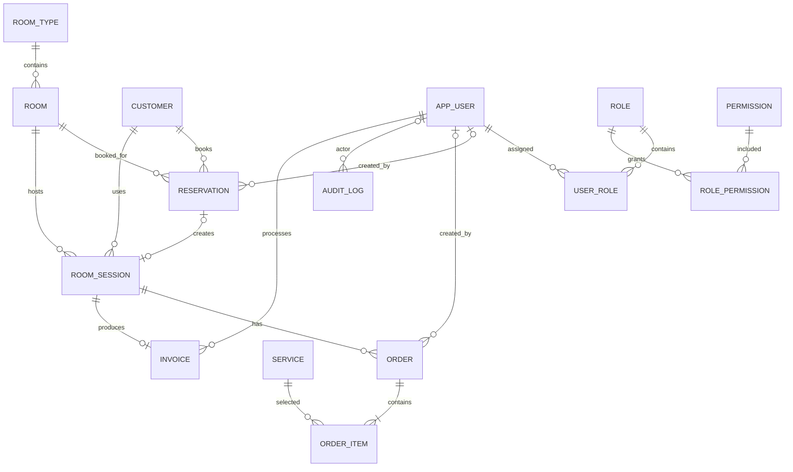

# Music Box Management System — Project Plan v1.3

> **Mục tiêu:** Đồ án ASP.NET MVC 5 trên .NET Framework 4.7.2 quản lý Music Box, giữ nghiệp vụ đã chốt và triển khai vừa sức.  
> **Phiên bản:** v1.3, cập nhật ngày 20/09/2026; giữ nguyên nghiệp vụ v1.2 và dùng nền tảng .NET Framework 4.7.2.  
> **Phạm vi chốt:** RBAC Role → Permission chỉnh được cho Staff/Manager; Admin toàn quyền cố định; lịch Ngày + Tuần; báo cáo web + Excel; Guest chỉ dùng SĐT.  
> **Phạm vi tài liệu:** Baseline để triển khai, không khẳng định các chức năng trong project đã được viết hoặc kiểm thử.

Những lựa chọn được giữ và khôi phục:

- Dùng ApplicationUser/IdentityRole của ASP.NET Identity 2 cùng Permission, RolePermission; không tự tạo hệ thống Role song song.
- Giữ Day + Week calendar, mặc định Day; Excel nằm trong phạm vi cuối đồ án, có thể triển khai gần cuối.
- Giữ Guest tra cứu bằng SĐT, Standard/VIP và luồng Reservation/Walk-in/RoomSession.
- Giữ snapshot giá/phòng/món, chuẩn hóa SĐT, availability theo khoảng sử dụng, NoShow không giữ slot quá hạn, server-side validation, transaction và kiểm thử.
- Checkout chỉ xem tiền tạm tính rồi Confirm; server tính lại và chốt thời gian thực tế khi xác nhận.
- Không có PreviewId, cache checkout, thời hạn giữ giá 5 phút hoặc global sp_getapplock.
- Không giới hạn check-in sớm 30 phút; vẫn phải có phòng trống và đủ khoảng sử dụng hợp lệ.

Giữ số mục 1–60 để đối chiếu. Các thay đổi nghiệp vụ/phạm vi sau v1.2 cần được người làm đồ án xác nhận; không tự cắt chức năng với lý do đơn giản hóa.

---

# 1. Tổng quan hệ thống

Music Box là mô hình phòng giải trí/âm nhạc riêng tính tiền theo thời gian sử dụng.

Một web application có hai khu vực:

- **Guest/Public:** xem phòng và lịch trống, đặt phòng, tra cứu bằng SĐT, hủy booking đúng điều kiện, xem phiên đang dùng, gia hạn, gọi/hủy món Pending và xem tiền tạm tính.
- **Back Office:** Staff vận hành; Manager quản lý phòng, dịch vụ và báo cáo; Admin quản lý thêm tài khoản, Permission của Staff/Manager và xem nhật ký thao tác.

Luồng trung tâm: `Reservation → RoomSession → Order → Invoice`. Walk-in bắt đầu trực tiếp từ RoomSession.

# 2. Tech Stack

| Thành phần | Lựa chọn |
| --- | --- |
| IDE | Visual Studio Community có workload ASP.NET và .NET Framework 4.7.2 Developer Pack |
| Backend | C#, ASP.NET MVC 5, .NET Framework 4.7.2 |
| Dữ liệu | Entity Framework 6, SQL Server, SSMS |
| Đăng nhập | ASP.NET Identity 2 + OWIN cookie authentication |
| Phân quyền | IdentityRole → RolePermission → Permission; custom AuthorizeAttribute kiểm tra Permission |
| Giao diện | Razor Views (.cshtml), Bootstrap, JavaScript |
| Calendar | FullCalendar timeGridDay/timeGridWeek, slot 30 phút |
| Excel | ClosedXML, xuất .xlsx từ cùng dữ liệu báo cáo trên web |
| Quản lý mã nguồn | Git |
| Kiểm thử | xUnit hoặc MSTest bản tương thích .NET Framework 4.7.2; integration test dữ liệu quan trọng trên SQL Server test riêng |
| Hỗ trợ viết code | Codex |

Một ASP.NET MVC 5 project ứng dụng và một project test là đủ. Controller nhận yêu cầu, service xử lý nghiệp vụ, DbContext truy cập dữ liệu. Không cần microservice, CQRS, event bus hoặc tầng repository chung bọc lại Entity Framework 6.

Calendar dùng bộ lọc Room và nhãn phòng trên event. Không cần giao diện resource timeline để đáp ứng Day + Week. Hai chế độ có trong [FullCalendar TimeGrid](https://fullcalendar.io/docs/timegrid-view). Excel dùng [ClosedXML](https://docs.closedxml.io/en/latest/); không cần cài Microsoft Excel trên máy chạy server.

# 3. Phạm vi MVP và đồ án

## 3.1 Bắt buộc trong bản cuối đồ án

- Identity, ba role Staff/Manager/Admin, Permission và RolePermission.
- Admin chỉnh Permission cho Staff/Manager; quyền Admin cố định.
- Phòng, hai loại Standard/VIP, một ảnh mỗi phòng, khóa/mở phòng.
- Khách hàng và tìm/tra cứu theo SĐT.
- Đặt phòng online hoặc Staff đặt hộ; hủy và NoShow.
- Check-in từ Reservation, walk-in, phiên sử dụng và gia hạn.
- Dịch vụ, Guest gọi món, Staff xác nhận, hủy Pending.
- Tiền tạm tính, checkout, ghi nhận Cash/BankTransfer, hóa đơn và in bằng trình duyệt.
- Dashboard vận hành và cảnh báo.
- Calendar Ngày + Tuần, mặc định Ngày.
- Báo cáo web và xuất Excel cùng bộ lọc; danh sách báo cáo tại mục 31.
- Quản lý tài khoản nội bộ và AuditLog cơ bản.
- Dữ liệu demo và kiểm thử các luồng chính.

Trong tài liệu này, MVP là toàn bộ phạm vi bắt buộc của bản cuối đồ án. Có thể làm bản demo trung gian chỉ có lịch ngày hoặc chưa có Excel, nhưng không coi đó là hoàn tất MVP.

## 3.2 Tùy chọn nâng chất lượng trình bày

- Dashboard tự làm mới.
- Biểu đồ bổ sung, giao diện lịch hoặc bộ lọc nâng cao ngoài mục 30–31.
- Tối ưu hiệu năng/khóa dữ liệu chuyên sâu khi có nhu cầu đã được xác nhận.

## 3.3 Ngoài phạm vi

Tồn kho, nhà cung cấp, khuyến mãi, voucher, membership, nhiều chi nhánh, quản lý ca, module bảo trì, đổi phòng trong cùng phiên, thanh toán ngân hàng tự động, cổng thanh toán, hóa đơn điện tử, thuế/VAT điện tử, công nợ, refund, split payment, SMS/email/OTP, đa ngôn ngữ, nhiều ảnh mỗi phòng, tạo Role hoặc RoomType mới.

# 4. Actor

## 4.1 Guest

Không có tài khoản. Tra cứu bằng SĐT và dùng chức năng Guest ở mục 1; chỉ đặt món cho phiên Active, chỉ hủy Order Pending. Không xem danh sách khách hàng hoặc hóa đơn lịch sử trên public.

## 4.2 Staff

Quyền mặc định: xem dashboard/lịch ngày-tuần; tìm/tạo/sửa Customer; tạo/hủy Reservation; check-in, walk-in, gia hạn hộ; tạo/xác nhận/hủy Pending Order; checkout; xem/in/tìm hóa đơn.

Staff được xem hóa đơn để vận hành nhưng không được xem báo cáo tổng hợp doanh thu, widget doanh thu hoặc xuất báo cáo Excel.

## 4.3 Manager

Mặc định có các quyền vận hành của Staff, thêm Room/RoomType/Service, báo cáo và Excel.

## 4.4 Admin

Có toàn bộ quyền cố định; quản lý thêm User, gán role, reset mật khẩu, chỉnh Permission của Staff/Manager và xem AuditLog.

Mô tả Staff/Manager ở trên là quyền seed mặc định. Sau khi Admin chỉnh, truy cập nghiệp vụ được quyết định bởi RolePermission và các giới hạn bất biến tại mục 5. Không suy ra quyền thực tế chỉ từ tên role.

# 5. RBAC Role → Permission

Chỉ có ba IdentityRole: Staff, Manager, Admin; không tạo role mới. Mỗi tài khoản nội bộ có đúng một role.

Quan hệ: ApplicationUser → IdentityUserRole → IdentityRole → RolePermission → Permission.

## 5.1 Danh mục Permission cố định trong code/seed

| Nhóm | Permission Code |
| --- | --- |
| Dashboard/lịch | Dashboard.View, Calendar.View |
| Reservation | Reservation.View, Reservation.Create, Reservation.Cancel |
| RoomSession | Session.View, Session.CheckIn, Session.WalkIn, Session.Extend, Session.CheckOut |
| Order | Order.View, Order.Create, Order.Confirm, Order.Cancel |
| Invoice | Invoice.View, Invoice.Print |
| Customer | Customer.View, Customer.Create, Customer.Edit |
| Danh mục | Room.Manage, RoomType.Edit, Service.Manage |
| Báo cáo | Report.View, Report.Export |
| Quản trị | User.Manage, Permission.Manage, Audit.View |

Không có UI tự tạo Permission Code. Admin bật/tắt các permission đã có cho Staff/Manager qua ma trận quyền.

## 5.2 Seed và cách tính quyền

- Staff: các nhóm vận hành từ Dashboard/lịch đến Customer.
- Manager: quyền mặc định Staff và thêm nhóm danh mục, báo cáo.
- Admin: luôn toàn quyền, không phụ thuộc các dòng RolePermission; không có ô cho sửa quyền Admin.
- RolePermission của Staff/Manager được lưu riêng. Manager không tự kế thừa động mọi thay đổi của Staff; Admin chỉnh từng role trên ma trận.
- Mặc định Manager có tập quyền rộng hơn Staff, nhưng quyền thực tế sau chỉnh phải đọc từ dữ liệu.

## 5.3 Giới hạn bất biến

- Staff không được Report.View/Report.Export hoặc widget doanh thu, kể cả do gán nhầm dữ liệu.
- User.Manage, Permission.Manage, Audit.View chỉ dành cho Admin.
- Report.Export cần cả Report.View; Invoice.Print cần cả Invoice.View.
- Các permission nghiệp vụ còn lại của Staff/Manager được Admin điều chỉnh; việc bật quyền danh mục cho Staff không đồng nghĩa cấp quyền báo cáo/quản trị.

## 5.4 Triển khai vừa sức

Tạo một `PermissionAuthorizeAttribute` dùng Permission Code và kiểm tra quyền hiện hành của User. Gắn attribute này lên controller/action cần bảo vệ; vẫn kiểm tra quyền ở server khi gọi trực tiếp URL.

`PermissionAuthorizeAttribute` gọi `PermissionService` để kiểm tra tài khoản active → role hiện tại → giới hạn bất biến → quyền Admin hoặc RolePermission tương ứng. Đọc quyền từ database theo request, không cache quyền qua nhiều request trong MVP; thay đổi ma trận có hiệu lực ở request tiếp theo.

Kiểm tra ở server cho action và endpoint dữ liệu; menu/nút cũng dùng cùng PermissionService. Guest vẫn dùng các endpoint public riêng theo rule Guest, không được đưa qua ma trận nội bộ.

Đổi role/reset mật khẩu làm mất hiệu lực đăng nhập cũ; khóa User bị chặn ở request kế tiếp. Dùng Identity cho xác thực/mật khẩu.

Trong các mục nghiệp vụ phía sau, tên Staff/Manager mô tả người thao tác và quyền mặc định. Mọi thao tác nội bộ vẫn cần Permission tương ứng hiện hành; được cấp một quyền không tự mở các quyền phụ thuộc chưa được cấp.

# 6. Giờ hoạt động và quy ước thời gian

- Mở cửa: **09:00–12:00**, **13:00–23:00**, mỗi ngày.
- Slot đặt trước: 30 phút; giờ bắt đầu đặt trước phải có phút 00 hoặc 30, giây bằng 0.
- Khoảng đặt trước/sử dụng dự kiến phải nằm hoàn toàn trong một ca mở cửa.
- Được kết thúc đúng 12:00 hoặc 23:00; không được bắt đầu đúng lúc kết thúc ca.
- Check-in, walk-in và checkout ghi nhận giờ thực tế, không ép về slot 30 phút.
- Không tạo phiên mới trong giờ nghỉ hoặc ngoài giờ mở cửa.

Toàn bộ khoảng thời gian dùng quy ước `[Start, End)`: có thể đặt sát nhau ở cùng mốc kết thúc/bắt đầu.

Giờ nghỉ chặn **đặt trước, check-in và gia hạn dự kiến**. Phiên thực tế còn Active lúc 12:00 hoặc 23:00 được cảnh báo và Staff xử lý theo mục 15–16; hệ thống không tự kết thúc phiên.

# 7. Quy tắc đặt phòng

Guest và Staff áp dụng cùng quy tắc đặt trước:

- Ngày sử dụng từ hôm nay đến ngày hiện tại cộng 30 ngày, tính theo giờ Việt Nam, bao gồm ngày cuối.
- StartTime không nhỏ hơn thời gian hiện tại của server.
- Thời lượng ban đầu chỉ có 60, 90, 120 hoặc 180 phút.
- Chọn phòng cụ thể đang active; chỉ nhập họ tên và SĐT.
- Không thu cọc; hợp lệ thì tạo Reservation = Confirmed ngay.
- Không chồng khoảng giữ lịch cùng Room hoặc cùng Customer, theo mục 38.

Nếu StartTime đúng bằng now, còn phải kiểm tra Room/Customer không có Active Session; ngoại lệ nhận booking khi đang có walk-in chỉ áp dụng cho StartTime > now.

Ví dụ P05 có booking 20:00–22:00: vẫn đặt được 17:00–19:00 hoặc 18:00–19:30; không đặt được 19:00–21:00.

Phòng đang có walk-in vẫn có thể nhận booking tương lai theo mục 12 và 38. Không cam kết khách trước sẽ tự rời phòng: Staff chịu trách nhiệm vận hành trước lượt tiếp theo.

# 8. Trạng thái Reservation

```text
Confirmed → CheckedIn → Completed
Confirmed → Cancelled
Confirmed → NoShow
```

- Chỉ Confirmed còn hiệu lực mới được check-in hoặc hủy.
- Cancelled, NoShow, Completed là trạng thái cuối; không khôi phục trực tiếp.
- Một Reservation tạo tối đa một RoomSession.
- Giữ nguyên StartTime/EndTime ban đầu để xem lịch sử.
- Sau check-in, khoảng giữ lịch được lấy từ RoomSession; không chặn thêm lần nữa bằng giờ Reservation cũ.

# 9. NoShow

Grace period là **15 phút**. Được check-in khi `now < StartTime + 15 phút`; đúng mốc 15 phút thì đã hết hạn.

Một tác vụ NoShow chạy định kỳ trong ứng dụng bằng cơ chế tương thích ASP.NET MVC 5 và ghi AuditLog với tác nhân System. Khi ứng dụng khởi động hoặc trước các truy vấn lịch/availability quan trọng, xử lý cả booking hết hạn còn tồn đọng; không phụ thuộc tuyệt đối vào việc website luôn hoạt động nền.

Ví dụ booking 20:00: hạn check-in là trước 20:15; worker có thể cập nhật trạng thái trong lần chạy tiếp theo, không bảo đảm đúng từng giây.

Để worker chậm không giữ slot sai, việc tính lịch và nhận thao tác phải xem Confirmed đã hết grace period là **không còn hiệu lực**, dù Status chưa kịp đổi. Check-in/hủy cũng kiểm tra lại thời gian ở server.

NoShow và check-in dùng transaction phù hợp ở mục 55.4: không được vừa tạo session vừa đổi cùng booking thành NoShow.

# 10. Hủy và đổi Reservation

## Guest

Chỉ hủy Confirmed còn hiệu lực khi `now <= StartTime - 2 giờ`.

Ghi `Status = Cancelled`, `CancellationReason = "Customer cancelled online"`. Dưới 2 giờ, hiển thị liên hệ cửa hàng.

## Staff/Manager/Admin

Được hủy Confirmed còn hiệu lực trước check-in, bắt buộc nhập lý do. Không đổi NoShow/Completed/CheckedIn sang Cancelled.

## Đổi lịch/phòng

Không sửa trực tiếp phòng, ngày, giờ hoặc thời lượng Reservation. Hủy booking cũ rồi tạo booking mới theo validation hiện tại; không tự bảo đảm slot mới còn trống sau khi hủy.

# 11. Check-in từ Reservation

Nhân viên có Session.CheckIn được thực hiện. Điều kiện:

1. Reservation Confirmed còn hiệu lực.
2. Room active, chưa có Active RoomSession.
3. Customer chưa có Active RoomSession ở bất kỳ phòng nào.
4. Chưa hết grace period: now < StartTime + 15 phút. Không đặt giới hạn phải cách StartTime tối đa 30 phút.
5. Tính candidateEnd = now + (Reservation.EndTime - Reservation.StartTime).
6. Toàn bộ [now, candidateEnd) nằm trong một ca mở cửa và không chồng lịch Room/Customer theo mục 38, bỏ qua chính Reservation đang check-in.

Check-in sớm được phép khi phòng trống và toàn bộ khoảng sử dụng hợp lệ; giờ thực tế không cần khớp slot 30 phút. Không tự đặt thêm giới hạn số phút check-in sớm.

Nếu hợp lệ, trong cùng transaction:

- Reservation = CheckedIn.
- Tạo RoomSession Active; ActualStartTime = now, ExpectedEndTime = candidateEnd.
- Snapshot giá và thông tin phòng theo mục 17/35.

Giữ đúng thời lượng đã đặt; không tự cắt thời lượng hoặc đẩy booking kế tiếp.

| Tình huống | Kết quả |
| --- | --- |
| Đặt 20:00–22:00, đến 19:00, khoảng 19:00–21:00 không trùng | Nhận, dù sớm hơn 30 phút |
| Đặt 20:00–22:00, đến 19:30, khoảng 19:30–21:30 không trùng | Nhận; dự kiến kết thúc 21:30 |
| Đặt 20:00–22:00, đến 20:10, chưa có lịch sau đó | Nhận; dự kiến kết thúc 22:10 |
| Cùng tình huống nhưng có booking 22:00–23:00 | Từ chối vì thiếu thời gian |
| Đặt 11:00–12:00, đến 11:10 | Từ chối vì kéo qua giờ nghỉ |
| Đến đúng StartTime + 15 phút | Hết hạn; không check-in Reservation |

Khi từ chối, không thay đổi dữ liệu. Staff giải thích lý do; nếu khách đồng ý thời gian ngắn hơn thì hủy booking còn hiệu lực và tạo walk-in khi đủ điều kiện, không sửa ngầm Reservation. NoShow có thể được phục vụ bằng walk-in mới nếu tình trạng hiện tại cho phép.

# 12. Walk-in

Walk-in không tạo Reservation và không bắt chọn duration:

```text
ReservationId = null
ExpectedEndTime = null
ActualStartTime = now
Status = Active
```

Điều kiện: đang trong giờ mở cửa, Room active và không có Active Session; Customer không có Active Session. Không được bắt đầu walk-in nếu Room hoặc Customer đang có Reservation Confirmed còn hiệu lực với StartTime <= now; dùng luồng check-in hoặc xử lý booking đó trước.

Nếu booking kế tiếp chưa bắt đầu, vẫn nhận walk-in. Hiển thị rõ **giờ cần trả phòng** là mốc sớm nhất trong: kết thúc ca hiện tại, booking Confirmed kế tiếp của Room, booking Confirmed kế tiếp của Customer.

Mốc này là cảnh báo tính động, không phải ExpectedEndTime; cập nhật khi có booking mới/hủy. Không tự checkout tại mốc cảnh báo.

**Lịch tương lai:** walk-in không có thời lượng cam kết nên không tạo một khoảng bận kéo dài vô hạn. Booking tương lai vẫn được nhận nếu thỏa các khoảng giữ lịch khác. Ví dụ khách walk-in lúc 17:00 không ngăn việc đặt 20:00–22:00 hoặc ngày mai. Dashboard cập nhật giờ cần trả phòng khi booking mới được tạo.

Trước khi nhận khách tiếp theo, luôn kiểm tra lại Active Session; không bao giờ cho hai phiên Active cùng phòng. Không cần thêm trạng thái hoặc bảng riêng cho walk-in.

# 13. RoomSession

Nguồn: từ Reservation hoặc walk-in. Chỉ có `Active` và `Completed`.

- Mỗi Room và mỗi Customer có tối đa một Active Session.
- ReservationId nullable và unique khi có giá trị.
- Active: ActualEndTime = null; Completed: ActualEndTime có giá trị và có đúng một Invoice.
- Session từ Reservation có ExpectedEndTime; walk-in để null.
- ExpectedEndTime là giờ dự kiến, không phải thời điểm tự kết thúc hoặc giới hạn số tiền.
- Không đổi Room/Customer của phiên đã tạo; không chuyển phòng trong một phiên.
- Không xóa session hoặc sửa phiên Completed.

Muốn đổi phòng: thanh toán/checkout phiên cũ rồi tạo phiên mới.

# 14. Gia hạn

Guest tra cứu bằng SĐT hoặc Staff mở phiên để gia hạn **phiên Active từ Reservation**.

- Mỗi lần chọn +30 hoặc +60 phút; có thể gia hạn nhiều lần nếu vẫn hợp lệ.
- Chỉ cho gia hạn trước hoặc đúng ExpectedEndTime. Khi đã quá giờ, Staff xử lý trực tiếp; không cộng gia hạn vào một mốc đã qua.
- `newEnd = ExpectedEndTime + số phút chọn`.
- Phần thời gian thêm phải nằm trong cùng ca mở cửa, không qua nghỉ trưa/23:00.
- Không chồng bất kỳ khoảng giữ lịch còn hiệu lực của Room hoặc Customer, bỏ qua chính phiên này.
- Kiểm tra và cập nhật trong transaction của nghiệp vụ; ghi AuditLog.
- Không sửa giờ Reservation hoặc đơn giá snapshot; không tạo phí gia hạn riêng.

Nếu trùng, từ chối và hiển thị giới hạn thời gian có thể sử dụng, không công khai thông tin khách khác. Walk-in không có chức năng gia hạn.

# 15. Quá giờ và tới lượt khách tiếp theo

Khi vượt ExpectedEndTime, giờ cần trả phòng của walk-in hoặc tới giờ nghỉ:

- Session vẫn Active, tiếp tục tính tiền thực tế.
- Dashboard cảnh báo; Staff chủ động yêu cầu trả phòng và checkout.
- Khách tiếp theo không được check-in khi phiên trước chưa Completed.
- Không tự chuyển phòng, tự hủy booking kế tiếp hoặc tự kết thúc phiên trước.

Lịch tương lai chỉ là lịch dự kiến. Phiên quá giờ không tự kéo dài khoảng giữ lịch đến vô hạn; khi phục vụ lượt kế tiếp luôn dùng trạng thái thực tế. Nếu Staff không check-in được khách kế tiếp trước hạn 15 phút, booking vẫn theo quy tắc NoShow; không thêm cơ chế gia hạn grace period. Đây là giới hạn vận hành được giữ đơn giản cho đồ án.

# 16. Sau 23:00 và trong giờ nghỉ

Không tạo booking/check-in/walk-in/gia hạn dự kiến ngoài ca. Phiên đã Active mà khách chưa trả phòng vẫn tiếp tục tính tiền; Staff vẫn được xử lý món đã gọi, checkout và xác nhận thanh toán.

Không nhận Order mới ngoài giờ mở cửa. Staff được hủy Pending hoặc xác nhận món đã phục vụ trong phiên Active. Dashboard hiển thị cảnh báo cho đến khi phiên hoàn tất.

# 17. Tính tiền phòng và chốt giá

Khi tạo RoomSession, sao chép `RoomType.PricePerHour` vào `RoomSession.HourlyRate` cho cả Reservation và walk-in. Giá này giữ nguyên suốt phiên; thay đổi giá RoomType chỉ áp dụng cho phiên tạo sau đó.

Reservation không lưu giá cam kết. Trang booking ghi rõ giá đang hiển thị là giá tham khảo hiện tại; giá áp dụng được chốt khi check-in.

```text
UsedMinutes = (BillingEndTime - ActualStartTime) tính theo phút, có phần thập phân
RawRoomCharge = HourlyRate × UsedMinutes / 60
RoomCharge = làm tròn RawRoomCharge về đồng, midpoint AwayFromZero
ServiceCharge = tổng Quantity × UnitPrice của Order Completed
TotalAmount = RoomCharge + ServiceCharge
```

- Tính cả phần giây thực tế; không cắt về số phút nguyên và không làm tròn block 10/30 phút.
- Đơn giá phòng/món là số nguyên đồng dương; dùng decimal khi tính toán. Vì ServiceCharge nguyên đồng, làm tròn RoomCharge một lần cũng cho tổng bằng làm tròn tổng cuối cùng.
- Tiền tạm tính dùng BillingEndTime = now; hóa đơn dùng BillingEndTime = checkoutNow tại Confirm theo mục 26.
- Ví dụ 120.000đ/giờ: 80 phút = 160.000đ; 147 phút = 294.000đ; 1 phút 30 giây = 3.000đ.
- Không có tiền tối thiểu, phụ thu, khuyến mãi hoặc VAT riêng.

# 18. RoomType

Chỉ seed hai loại, không thêm/xóa:

| Code | Name | Capacity | PricePerHour | Amenities |
| --- | --- | --- | --- | --- |
| STANDARD | Standard | 4 | 120.000đ | TV, Điều hòa, 2 micro, Loa, Đèn LED |
| VIP | VIP | 6 | 200.000đ | TV lớn, Điều hòa, 4 micro, Loa cao cấp, Đèn LED, Sofa |

Manager/Admin được sửa Name, Capacity, PricePerHour, Amenities, Description; không sửa Code. Capacity > 0, PricePerHour > 0, Amenities bắt buộc. Tiện ích là chuỗi thuộc loại phòng, không có bảng Amenity riêng.

# 19. Room

Manager/Admin được thêm, sửa, upload một ảnh, khóa/mở. Không xóa vật lý.

- RoomCode unique, không sửa sau khi tạo để mã phòng ổn định.
- RoomType bắt buộc; không đổi RoomType khi phòng đang có Active Session.
- ImageUrl lưu đường dẫn; file ở Content/uploads/rooms; chỉ nhận JPEG/PNG/WebP hợp lệ, tối đa 5 MB, tên file do server tạo.
- `IsActive = false` bắt buộc InactiveReason.
- **Không khóa phòng nếu có Active Session hoặc bất kỳ Reservation Confirmed còn hiệu lực nào**, kể cả booking đã tới giờ đang trong grace period.
- Manager xử lý booking/checkout trước, sau đó khóa; thao tác kiểm tra và khóa dùng cùng cơ chế đồng thời với đặt phòng.
- Phòng inactive không nhận booking/check-in/walk-in và không xuất hiện trong danh sách public; lịch sử vẫn xem được nội bộ.

Không có module bảo trì hoặc lịch khóa phòng theo ngày. Giá/tên loại phòng thay đổi không làm thay đổi session/hóa đơn đã lưu snapshot.

# 20. Trạng thái phòng

Không lưu Room.Status cố định. **Card vận hành ở hiện tại**:

```text
Room inactive                          → Inactive
Có Active Session                      → Occupied
Có Confirmed còn hiệu lực đang tới lượt → Reserved
Còn lại                                → Available
```

Confirmed đang tới lượt nghĩa là `StartTime <= now < EndTime` và chưa hết grace period. Booking ngày mai không khiến phòng hôm nay Reserved.

Lịch của ngày/slot được chọn dùng các khoảng thời gian ở mục 38–39; không lấy trạng thái card tại now áp cho cả lịch tương lai.

# 21. Customer và SĐT

Customer có CustomerId, FullName, PhoneNumber; PhoneNumber bắt buộc và unique sau chuẩn hóa.

Quy ước MVP dùng số di động Việt Nam:

1. Loại bỏ khoảng trắng, dấu chấm, dấu gạch ngang.
2. Đổi tiền tố +84 hoặc 84 thành 0 nếu kết quả là số hợp lệ.
3. Chỉ nhận 10 chữ số bắt đầu bằng 0; không kiểm tra đầu số nhà mạng hoặc tích hợp xác minh.

Cùng một hàm chuẩn hóa cho đặt phòng, tra cứu, walk-in và sửa khách hàng. SĐT lưu dạng chuỗi để giữ số 0 đầu.

Tìm thấy SĐT thì dùng Customer cũ; không tự ghi đè FullName bằng tên Guest vừa nhập. Chưa có thì tạo mới. Staff được tìm theo tên/SĐT, sửa FullName/PhoneNumber; đổi SĐT phải unique và áp dụng cho tra cứu về sau.

Không xóa Customer. Trang chi tiết nội bộ có lịch sử Reservation, Session, Invoice, số lần hoàn tất và lần sử dụng gần nhất. Liên kết lịch sử bằng CustomerId, không bằng chuỗi SĐT.

# 22. Guest Lookup — giữ cách truy cập của v1.0

Guest không có account, chỉ nhập **PhoneNumber** đã chuẩn hóa để tra cứu:

- Reservation Confirmed còn hiệu lực và phiên Active liên quan.
- Xem/hủy booking đúng rule.
- Xem phiên Active và tiền tạm tính.
- Gia hạn phiên từ Reservation theo mục 14.
- Gọi món, xem Order trong phiên hiện tại, hủy Pending.

Không yêu cầu OTP, mật khẩu, mã booking, mã truy cập bí mật hoặc link xác thực. Không mở danh sách toàn bộ khách hàng/lịch sử hóa đơn trên public. Cách truy cập này được giữ theo yêu cầu riêng của người làm đồ án; không đưa việc thay đổi nó vào điều kiện hoàn thành MVP.

# 23. Service

ServiceId, Name, Category, Price, Description, IsActive.

- Category cố định: Đồ uống, Đồ ăn, Khác; không cần bảng riêng.
- Price là số nguyên đồng > 0.
- Inactive thì không được chọn trong Order mới; Order đã tạo giữ nguyên.
- Không quản lý tồn kho, không xóa vật lý.
- Đổi tên/giá không cập nhật ngược OrderItem đã lưu snapshot.

# 24. Order

Mỗi lần gửi giỏ món tạo một Order với ít nhất một OrderItem, gắn một Active RoomSession.

```text
Guest tạo: Pending → Completed hoặc Cancelled
Staff tạo hộ: Completed ngay (chỉ khi món đã được phục vụ)
```

- Staff xác nhận Completed sau khi phục vụ, không phải chỉ vừa đọc yêu cầu.
- Guest hoặc Staff được hủy Pending; Completed/Cancelled không đổi tiếp.
- Không sửa item/số lượng sau khi tạo; muốn sửa thì hủy Pending và tạo Order mới.
- Mỗi Service chỉ xuất hiện một dòng trong một Order; tổng Quantity cho dòng đó từ 1 đến 10.
- UnitPrice và ServiceNameSnapshot được lưu khi tạo Order.
- Không có ghi chú món.
- Staff tạo Completed và Guest tạo Pending đều yêu cầu đang trong giờ mở cửa; xác nhận/hủy Pending cũ theo mục 16.
- Session Completed không được tạo/xác nhận/hủy thêm Order.

Cancel và Confirm cùng lúc: chỉ thao tác đầu tiên hợp lệ được lưu; thao tác còn lại báo trạng thái đã thay đổi. Việc tắt Service không tự hủy Pending đã có.

# 25. Tiền tạm tính

```text
CurrentTotal = RoomCharge tính đến now + Completed ServiceCharge
```

Hiển thị thời điểm cập nhật, giờ bắt đầu, đơn giá đã chốt, thời lượng thực tế và tổng tiền. Pending/Cancelled không được cộng; Pending vẫn hiển thị riêng với trạng thái để khách hiểu món chưa được tính.

Dùng chung BillingService với hóa đơn; giá trị đang xem không khóa số tiền tại Confirm. MVP có nút làm mới; không cần cập nhật từng giây hoặc SignalR.

# 26. Checkout đơn giản

Không có Invoice Unpaid hoặc trạng thái Session thứ ba. Hoàn tất khi Staff có Session.CheckOut xác nhận đã nhận tiền.

## 26.1 Mở màn hình xác nhận

Server đọc phiên Active, dùng BillingService tính tiền đến thời điểm hiện tại và hiển thị:

- Tiền phòng, các Order Completed, tổng tiền tạm tính và thời điểm tính.
- Pending Order sẽ bị hủy khi checkout thành công.
- Lựa chọn Cash/BankTransfer và nút Confirm.

Bước này chỉ đọc dữ liệu: không chốt ActualEndTime, không hủy Pending, không tạo Invoice. Quay lại thì phiên tiếp tục như bình thường.

Không tạo PreviewId, không lưu bản tính vào session/cache, không có thời hạn giữ giá 5 phút. Browser có thể hiển thị số tiền nhưng server không dùng nó làm nguồn tính hóa đơn.

## 26.2 Confirm

Trong một transaction ngắn theo mục 55.4:

1. Kiểm tra quyền, đọc lại phiên; nếu đã có Invoice thì trả về hóa đơn đó, không tạo thêm.
2. Kiểm tra Session vẫn Active và PaymentMethod hợp lệ.
3. Đọc lại toàn bộ Order của phiên, lấy thời gian server mới nhất làm checkoutNow.
4. Tính lại RoomCharge đến checkoutNow và ServiceCharge của Order Completed.
5. Hủy tất cả Order còn Pending.
6. Ghi ActualEndTime = checkoutNow; tạo Invoice với PaidAt = checkoutNow và số tiền vừa tính lại.
7. Session = Completed; Reservation liên quan = Completed; ghi AuditLog, commit.
8. Mở Invoice để xem/in; tính lại trạng thái Room.

Nếu validation/lưu thất bại: rollback toàn bộ; chưa kết thúc phiên, chưa hủy Pending một phần. Không giữ transaction khi Staff xem màn hình hoặc chờ khách trả tiền.

## 26.3 Ý nghĩa số tiền hiển thị

Tiền trước Confirm là **tạm tính**, không phải báo giá cố định. Tổng cuối có thể tăng vì thời gian chờ hoặc món mới Completed. Ví dụ 120.000đ/giờ, chờ thêm một phút thì tiền phòng tăng 2.000đ.

Màn hình phải ghi rõ quy ước này và có nút tính lại trước Confirm. Staff đối chiếu số tiền thu với tổng cuối; ứng dụng chỉ ghi nhận xác nhận thủ công, không tự kiểm số tiền ngân hàng. Bản v1.2 không cam kết tổng cuối bằng số tạm tính đã xem trước đó.

# 27. Payment

Chỉ Cash hoặc BankTransfer; QR thủ công được coi là BankTransfer. Staff kiểm tra nhận tiền và xác nhận trong ứng dụng.

Một Invoice có đúng một PaymentMethod và được coi là đã thanh toán đủ. Không API ngân hàng, tự đối soát, công nợ, split payment, discount hoặc refund.

ActualEndTime và PaidAt cùng lấy checkoutNow ở request Confirm. Doanh thu lọc theo PaidAt. Số tiền do server tính lại tại Confirm; số trên trang trước đó chỉ là tạm tính theo mục 26.

# 28. Invoice và phiếu in

Invoice chỉ tạo khi xác nhận thanh toán; không sửa/xóa/hủy. Mỗi RoomSession có tối đa một Invoice, InvoiceNumber unique.

Tìm theo mã hóa đơn, khoảng ngày PaidAt hoặc SĐT hiện tại của Customer. Tài khoản có Invoice.View/Invoice.Print được xem/in theo mục 5; báo cáo tổng hợp yêu cầu Report.View và Staff luôn bị chặn.

Phiếu hiển thị: tên cửa hàng cố định, mã hóa đơn, mã phòng và loại phòng lúc check-in, ActualStartTime/ActualEndTime, HourlyRate, thời lượng, tiền phòng, tên/số lượng/đơn giá món Completed, tiền dịch vụ, tổng tiền, PaymentMethod, tên nhân viên lúc thanh toán, PaidAt.

Dữ liệu in lại lấy từ:

- RoomSession: RoomCodeSnapshot, RoomTypeCodeSnapshot, RoomTypeNameSnapshot, HourlyRate, các mốc thời gian.
- OrderItem: ServiceNameSnapshot, Quantity, UnitPrice.
- Invoice: các tổng tiền, ProcessedByNameSnapshot, PaymentMethod, PaidAt.

Không lấy giá/tên hiện tại của RoomType/Service/User để thay nội dung phiếu cũ. Không cần InvoiceItem riêng vì Order Completed và OrderItem đã bất biến.

MVP in trang Razor qua trình duyệt với CSS print. Không xuất PDF server hoặc kết nối máy in chuyên dụng.

# 29. Dashboard

Người có Dashboard.View thấy card trạng thái phòng hiện tại, booking hôm nay, phiên đang dùng và Pending Order; thao tác từ dashboard vẫn kiểm tra Permission tương ứng.

Cảnh báo bắt buộc: booking còn tối đa 5 phút tới hạn NoShow; phiên quá giờ; walk-in/phiên ảnh hưởng lượt kế tiếp; còn khách trong giờ nghỉ hoặc sau 23:00.

Manager có Report.View hoặc Admin thấy thêm tổng doanh thu hôm nay từ Invoice.PaidAt. Staff không được gọi endpoint lấy số tổng hợp này dù dữ liệu RolePermission bị gán nhầm.

MVP có nút làm mới và tải lại sau thao tác; thông tin hiển thị kèm thời điểm cập nhật. Tự refresh định kỳ là tùy chọn.

# 30. Calendar Ngày + Tuần

Cả Day View và Week View đều thuộc MVP; mặc định Day View. Người có Calendar.View xem được hai chế độ. Có thể triển khai Day trước, nhưng bản cuối phải có cả Week.

Dùng FullCalendar timeGridDay/timeGridWeek, slot 30 phút, hiển thị 09:00–23:00 và đánh dấu giờ nghỉ 12:00–13:00. Bộ lọc Room; nếu xem nhiều phòng, event có RoomCode và màu/nhãn để phân biệt. Không cần resource timeline.

- Confirmed còn hiệu lực: vẽ khoảng giữ lịch.
- Session Active từ Reservation: giờ thực tế và kết thúc dự kiến; không vẽ thêm booking CheckedIn cũ thành một khoảng chặn khác.
- Walk-in: vẽ thời gian thực tế tới now, nhãn chưa chốt kết thúc và giờ cần trả phòng.
- Session Completed: xem khoảng ActualStartTime–ActualEndTime của ngày/tuần được chọn.
- Giờ thực tế vẫn có thể là 19:37; không làm tròn dữ liệu theo ô lịch.
- Quá giờ có cảnh báo; không sửa giờ booking của khách khác.

Guest chỉ xem trống/bận theo ngày của một phòng, không thấy tên/SĐT người khác. Hai chế độ nội bộ dùng cùng AvailabilityService và quy tắc mục 38–39. Không kéo-thả sửa Reservation.

# 31. Báo cáo web và Excel

Thuộc scope cuối đồ án. Manager mặc định có Report.View/Report.Export, Admin luôn có quyền; Staff bị chặn. Nếu Admin tắt quyền Manager thì server và UI đều áp dụng ngay.

## 31.1 Báo cáo trong phạm vi

- Doanh thu theo ngày, tháng, RoomType.
- Số lượt sử dụng từng Room.
- Tỷ lệ sử dụng Room theo lịch mở cửa tiêu chuẩn.
- Booking theo status, gồm Cancelled và NoShow.
- Doanh thu Service, Service bán nhiều nhất.

Có thể dùng một trang với các tab/bảng, biểu đồ đơn giản khi phù hợp; không tạo mỗi chỉ số thành một module riêng. Không cần bảng Report.

## 31.2 Bộ lọc và nguồn dữ liệu

- FromDate–ToDate theo ngày Việt Nam; truy vấn [đầu FromDate, đầu ngày sau ToDate).
- RoomType dùng cho doanh thu theo loại phòng dựa trên snapshot; Room dùng cho báo cáo phòng, Service dùng cho báo cáo món. Tỷ lệ sử dụng lọc theo Room, không tái dựng lịch sử thay đổi RoomType.
- Doanh thu và số Invoice lấy từ Invoice.PaidAt; không cộng tiền tạm tính của phiên Active.
- Doanh thu RoomType dùng RoomSession.RoomTypeCodeSnapshot, không phân loại lại lịch sử theo loại phòng hiện tại.
- Doanh thu món/top món lấy Order Completed của phiên có Invoice, lọc bằng PaidAt; nhóm theo ServiceId, không gộp bằng tên món.
- Số lượt sử dụng: đếm phiên Completed có ActualEndTime trong kỳ.
- Booking theo status: lọc theo Reservation.StartTime trong kỳ; Confirmed hết grace period được biểu diễn NoShow ngay cả khi worker chưa ghi status.
- Báo cáo ghi rõ mốc lọc để không nhầm ngày đặt, ngày sử dụng và ngày thanh toán.

## 31.3 Tỷ lệ sử dụng đơn giản

Một ngày đầy đủ có 780 phút mở cửa. Chỉ tính các đoạn giao với 09:00–12:00 và 13:00–23:00; thời gian ngoài ca không làm tỷ lệ vượt 100%.

Với từng Room:

- Cửa sổ thống kê bắt đầu từ mốc muộn hơn giữa đầu kỳ và Room.CreatedAt; kết thúc ở mốc sớm hơn giữa cuối kỳ và now.
- Mẫu số là tổng phút mở cửa tiêu chuẩn trong cửa sổ đó; không tính thời gian tương lai của hôm nay.
- Tử số là phần ActualStartTime–ActualEndTime của các phiên Completed, hoặc ActualStartTime–now của phiên Active, giao với cùng cửa sổ và các ca mở cửa.
- Tỷ lệ = tổng tử số / tổng mẫu số × 100; mẫu số 0 thì hiển thị không có dữ liệu.

Không lưu lịch sử khóa phòng nên không trừ ngày phòng từng bị khóa; nhãn báo cáo phải ghi **theo lịch mở cửa tiêu chuẩn**, không gọi là thời gian mở bán thực tế. Không dùng IsActive hiện tại để loại toàn bộ lịch sử của phòng. Quy ước này không yêu cầu thêm bảng theo dõi bảo trì/khóa phòng.

## 31.4 Excel bắt buộc

Nút xuất dùng đúng tab/báo cáo và bộ lọc đang xem, cùng query của ReportService. File .xlsx có tên báo cáo, bộ lọc, thời điểm xuất, tiêu đề cột, dữ liệu và dòng tổng khi phù hợp. Có dữ liệu lịch sử của danh mục đã inactive.

Report.Export cần Report.View; kiểm tra trực tiếp ở endpoint tải file. Không xuất PDF báo cáo và không cần tạo mẫu Excel phức tạp.

# 32. AuditLog

Chỉ ghi hành động quan trọng: tạo/hủy Reservation, NoShow, check-in, walk-in, gia hạn, tạo/xác nhận/hủy Order, checkout/thanh toán, cập nhật/khóa phòng, cập nhật RoomType/Service/Customer, quản lý User/role/RolePermission/reset mật khẩu.

```text
AuditLogId
ActorType: Staff | Guest | System
UserId nullable
Action
EntityName
EntityId
Description
CreatedAt
```

- ActorType = Staff dùng cho mọi tài khoản nội bộ, UserId có giá trị.
- Guest/System thì UserId = null; Description/EntityId chỉ rõ đối tượng liên quan.
- Không tạo tài khoản đăng nhập giả cho worker NoShow.
- Ghi log trong cùng transaction với thay đổi nghiệp vụ; lỗi thì rollback cùng thay đổi.
- Không log mật khẩu, mọi request hoặc mọi click. Admin xem, không chỉnh/xóa qua UI.

# 33. Tài khoản nội bộ và Identity

ApplicationUser kế thừa IdentityUser, thêm FullName và IsActive. Username unique theo Identity; không bắt buộc Email/PhoneNumber. Dùng UserManager cho mật khẩu, không tự gán PasswordHash.

- Dùng IdentityRole và IdentityUserRole có sẵn; không thêm Role.cs hoặc RoleId trực tiếp vào ApplicationUser.
- RolePermission.RoleId tham chiếu AspNetRoles.Id; khi dùng Identity mặc định, RoleId/UserId là string.
- Admin tạo/sửa/khóa tài khoản, gán đúng một role và chỉnh quyền của Staff/Manager theo mục 5.
- Không hard delete User vì còn Invoice/AuditLog.
- Không cho Admin tự khóa/tự hạ role; luôn còn ít nhất một Admin active, kể cả thao tác quản trị đồng thời.
- Quên mật khẩu: Admin đặt lại; không email/OTP.
- Khóa User bị chặn ở request kế tiếp; đổi role/reset mật khẩu làm đăng nhập cũ mất hiệu lực.
- Đổi RolePermission có hiệu lực ở request kế tiếp vì PermissionService đọc dữ liệu hiện hành, không dùng danh sách quyền cũ trong cookie.

Các file ApplicationUser, Permission, RolePermission, AuditLog đã có trong project có thể tiếp tục hoàn thiện theo mô hình này; không cần xóa chỉ vì v1.1 từng đề xuất quyền cố định.

# 34. Ngôn ngữ

Chỉ tiếng Việt, hiển thị tiền VND và giờ Việt Nam. Không triển khai localization trong MVP.

# 35. Mô hình dữ liệu

Các trường ID là khóa chính; tất cả liên kết nghiệp vụ có foreign key, hạn chế cascade delete. Thời gian theo mục 55.1, tiền theo mục 55.2.

| Entity | Trường chính |
| --- | --- |
| RoomType | RoomTypeId, Code, Name, Capacity, PricePerHour, Amenities, Description |
| Room | RoomId, RoomCode, RoomTypeId, Name, ImageUrl, Description, IsActive, InactiveReason, CreatedAt |
| Customer | CustomerId, FullName, PhoneNumber |
| Reservation | ReservationId, CustomerId, RoomId, StartTime, EndTime, Status, CancellationReason nullable, CreatedByUserId nullable, CreatedAt |
| RoomSession | RoomSessionId, CustomerId, RoomId, ReservationId nullable, ActualStartTime, ExpectedEndTime nullable, ActualEndTime nullable, HourlyRate, RoomCodeSnapshot, RoomTypeCodeSnapshot, RoomTypeNameSnapshot, Status |
| Service | ServiceId, Name, Category, Price, Description, IsActive |
| Order | OrderId, RoomSessionId, CreatedByUserId nullable, Status, CreatedAt |
| OrderItem | OrderItemId, OrderId, ServiceId, ServiceNameSnapshot, Quantity, UnitPrice |
| Invoice | InvoiceId, InvoiceNumber, RoomSessionId, RoomCharge, ServiceCharge, TotalAmount, PaymentMethod, ProcessedByUserId, ProcessedByNameSnapshot, PaidAt |
| ApplicationUser | Các trường IdentityUser, FullName, IsActive |
| IdentityRole/UserRole | Bảng có sẵn của Identity cho Staff/Manager/Admin và quan hệ gán role |
| Permission | PermissionId, Code, Name |
| RolePermission | RoleId (string, FK AspNetRoles.Id), PermissionId (FK Permission.PermissionId) |
| AuditLog | AuditLogId, ActorType, UserId nullable, Action, EntityName, EntityId, Description, CreatedAt |

Có Permission và RolePermission; không tạo Role entity song song IdentityRole. Không cần bảng Report, Payment, Maintenance hoặc CheckoutPreview. Xem tiền trước Confirm chỉ đọc dữ liệu, không lưu bản tính tạm.

Ràng buộc database bắt buộc:

- Unique Permission.Code; khóa chính ghép RolePermission (RoleId, PermissionId), foreign key tới IdentityRole và Permission.
- Unique RoomType.Code; chỉ STANDARD/VIP.
- Unique Room.RoomCode; Customer.PhoneNumber đã chuẩn hóa.
- Filtered unique RoomSession.RoomId khi Status = Active.
- Filtered unique RoomSession.CustomerId khi Status = Active.
- Filtered unique RoomSession.ReservationId khi không null.
- Unique Invoice.RoomSessionId, Invoice.InvoiceNumber.
- Unique (OrderId, ServiceId).
- Quantity từ 1 đến 10; giá phòng/món/snapshot > 0; Capacity > 0.
- StartTime < EndTime; ActualEndTime nếu có phải >= ActualStartTime; ExpectedEndTime nếu có phải > ActualStartTime.
- TotalAmount = RoomCharge + ServiceCharge; các tổng tiền >= 0; PaymentMethod chỉ Cash/BankTransfer.

Session từ Reservation phải có cùng RoomId/CustomerId với Reservation; kiểm tra ở service trong transaction. Không dùng unique (RoomId, StartTime) để thay kiểm tra overlap vì nó không ngăn các khoảng khác giờ bắt đầu nhưng chồng nhau.

# 36. ERD khái quát



ROLE trong sơ đồ là IdentityRole, không phải bảng Role tự tạo. Identity hỗ trợ nhiều role ở cấu trúc bảng, nhưng ứng dụng v1.2 chỉ cho gán đúng một role/User. Staff/Manager dùng RolePermission; Admin toàn quyền cố định. Session Completed có đúng một Invoice nhờ workflow transaction; ở trạng thái Active chưa có Invoice.

# 37. Quan hệ và dữ liệu lịch sử

- RoomType 1–N Room; Customer/Room 1–N Reservation và RoomSession.
- Reservation 0..1–0..1 RoomSession; mỗi session có tối đa một nguồn Reservation.
- RoomSession 1–0..N Order; Order 1–1..N OrderItem.
- Service 1–0..N OrderItem; không xóa Service khi đã được tham chiếu.
- RoomSession 1–0..1 Invoice; User 1–0..N Invoice.
- AuditLog có thể không có User khi tác nhân Guest/System.
- IdentityRole N–N Permission qua RolePermission; User có đúng một role theo quy tắc ứng dụng.

Giữ liên kết ID để tra cứu; dùng snapshot để hiển thị giá/tên tại thời điểm nghiệp vụ. Không cập nhật lại snapshot khi sửa danh mục.

# 38. Availability Logic — một nguồn quy tắc

## 38.1 Khoảng thời gian chồng nhau

```text
newStart < existingEnd AND newEnd > existingStart
```

## 38.2 Những gì giữ lịch

| Dữ liệu | Khoảng chặn booking tương lai |
| --- | --- |
| Reservation Confirmed còn grace period | [StartTime, EndTime) |
| Session Active từ Reservation | [ActualStartTime, ExpectedEndTime) |
| Reservation CheckedIn | Không chặn thêm; đã được đại diện bởi session |
| Walk-in Active | Không tạo khoảng chặn tương lai vì không có giờ kết thúc cam kết |
| Session quá ExpectedEndTime | Không tự nới khoảng chặn; hiển thị quá giờ và kiểm tra trạng thái thực tế khi nhận khách |
| Cancelled, NoShow, Completed, Confirmed đã hết grace period | Không giữ lịch tương lai |

Áp dụng cùng cách kiểm tra cho **Room và Customer**. Ví dụ một Customer đang có phiên từ Reservation dự kiến kết thúc 21:30 không được đặt một phòng khác lúc 21:00. Customer đang walk-in có thể đặt trước, nhưng không được check-in phiên mới khi phiên cũ còn Active.

## 38.3 Tạo Reservation

Kiểm tra Room active, ngày/giờ/thời lượng ở mục 6–7, rồi không overlap các khoảng giữ lịch của Room và Customer. Booking bắt đầu đúng now yêu cầu Room/Customer không có Active Session; booking tương lai không dùng điều kiện đơn giản "có Active Session thì cấm mọi booking".

## 38.4 Check-in, walk-in và gia hạn

- Check-in: kiểm tra cả khoảng thực tế dự kiến, bỏ qua Reservation nguồn, đồng thời bắt buộc Room/Customer không có Active Session.
- Walk-in: kiểm tra Room/Customer hiện tại theo mục 12; tính giờ cần trả phòng từ lịch kế tiếp và giờ kết thúc ca.
- Gia hạn: kiểm tra phần thời gian thêm, bỏ qua phiên đang gia hạn, cùng ca mở cửa.

AvailabilityService trả lý do từ chối cụ thể. Mọi thao tác ghi phải chạy lại kiểm tra bên trong transaction phù hợp ở mục 55.4, không dựa vào lịch đã tải trước đó.

# 39. Room Status Resolver và lịch theo thời điểm

Tách hai hàm:

- `GetCurrentRoomStatus(room, now)`: dùng thứ tự ưu tiên Inactive → Occupied → Reserved → Available ở mục 20.
- `GetRoomSchedule(room, rangeStart, rangeEnd, now)`: lấy các khoảng giữ lịch theo mục 38, cộng dữ liệu sử dụng thực tế giao với khoảng đang xem. Day truyền một ngày; Week truyền tuần từ thứ Hai tới trước thứ Hai kế tiếp theo giờ Việt Nam.

Phiên Active có đoạn đã sử dụng `[ActualStartTime, now)`; phiên Completed có `[ActualStartTime, ActualEndTime)`. Phần dự kiến của phiên từ Reservation chỉ đến ExpectedEndTime. Không lấy Occupied tại now để tô kín lịch của ngày mai.

Ô Guest thể hiện khả năng đặt theo lịch; thông báo kiểm tra lại khi gửi booking. Staff xem thêm trạng thái thực tế và cảnh báo. Trạng thái của phòng inactive là dữ liệu hiện tại; MVP không tái dựng lịch sử khóa/mở phòng theo ngày.

# 40. Workflow — Guest Booking

```text
Chọn phòng → ngày → slot bắt đầu → thời lượng
→ nhập tên/SĐT → chuẩn hóa SĐT
→ transaction phù hợp (mục 55.4)
→ tìm/tạo Customer → kiểm tra lịch Room/Customer
→ tạo Confirmed + AuditLog → commit → trang thành công
```

Nếu validation thất bại, rollback cả Customer vừa tạo; hiển thị lại lịch/lý do. Guest đã có SĐT không bị ghi đè tên. Không SMS/email hoặc bước xác thực bổ sung.

# 41. Workflow — Reservation Check-in

```text
Staff chọn Confirmed
→ transaction phù hợp (mục 55.4) → đọc lại trạng thái/thời gian
→ kiểm tra grace period, giờ mở cửa, Room/Customer và toàn bộ khoảng sử dụng
→ snapshot giá/phòng → tạo Active Session
→ Reservation CheckedIn + AuditLog → commit
```

Bấm check-in lặp lại trên booking đã có session thì trả về session đó, không tạo phiên thứ hai. Booking hết hạn hoặc không đủ khoảng trống bị từ chối, không tự chuyển thành walk-in.

# 42. Workflow — Walk-in

```text
Staff nhập tên/SĐT, chọn phòng
→ transaction phù hợp (mục 55.4) → tìm/tạo Customer
→ kiểm tra giờ mở cửa, Room/Customer, booking đang tới lượt
→ tạo Session Active, không Reservation/ExpectedEndTime
→ snapshot giá/phòng + AuditLog → commit
→ hiển thị giờ cần trả phòng và booking kế tiếp
```

Không tự yêu cầu thời lượng hoặc tạo Reservation giả cho walk-in.

# 43. Workflow — Gia hạn

```text
Guest tra cứu SĐT hoặc Staff mở phiên
→ chọn +30/+60 → transaction phù hợp (mục 55.4)
→ đọc lại phiên, ExpectedEndTime và lịch Room/Customer
→ kiểm tra chưa quá giờ, cùng ca, không conflict
→ cập nhật ExpectedEndTime + AuditLog → commit
```

Reservation gốc và HourlyRate giữ nguyên; nếu conflict thì không thay đổi dữ liệu.

# 44. Workflow — Guest Order

```text
Tra cứu SĐT → mở Active Session → chọn món/số lượng
→ transaction phù hợp (mục 55.4) → kiểm tra phiên, giờ và Service
→ tạo Order Pending + item snapshot → commit
→ Staff phục vụ → xác nhận Completed trong transaction khác
```

Guest hủy Pending trước khi Staff xác nhận; chỉ một thao tác chuyển trạng thái có thể thành công.

# 45. Workflow — Staff Order

Staff chọn Active Session, nhập món đã phục vụ; kiểm tra giờ/Service/số lượng, lưu Order Completed cùng item snapshot và AuditLog trong transaction của nghiệp vụ. Không dùng thao tác này cho món mới chỉ nhận yêu cầu nhưng chưa phục vụ.

# 46. Workflow — Checkout & Payment

Staff mở Checkout → server tính tiền hiện tại → hiện tiền tạm tính và chọn Cash/BankTransfer → Confirm → mở transaction → đọc lại Session/Orders → lấy checkoutNow → tính lại tiền cuối → hủy Pending → ActualEndTime = checkoutNow → tạo Invoice, PaidAt = checkoutNow → Session/Reservation Completed + AuditLog → commit → xem/in Invoice.

Quay lại trước Confirm không thay đổi dữ liệu. Confirm lặp trả về Invoice đã có. Tiền form gửi lên không quyết định số tiền lưu. Không tạo mã xem trước, cache thanh toán hoặc giữ transaction qua hai request.

# 47. Validation bắt buộc

| Nhóm | Kiểm tra |
| --- | --- |
| Reservation | Room/Customer hợp lệ; slot 30 phút; 60/90/120/180; không quá khứ; tối đa 30 ngày; cùng ca; Room active; không overlap Room/Customer |
| Check-in | Confirmed còn hạn; check-in sớm không giới hạn số phút nhưng đủ khoảng sử dụng; Room/Customer không Active; toàn bộ duration còn chỗ và trong ca |
| Walk-in | Trong ca; Room active/trống thực tế; Customer không Active; không có booking đang tới lượt của Room/Customer |
| Gia hạn | Phiên từ Reservation Active, chưa quá giờ; +30/+60; cùng ca; không overlap Room/Customer |
| Customer | Tên/SĐT bắt buộc, chuẩn hóa thống nhất, SĐT unique |
| Room | Mã unique; loại/ảnh bắt buộc; khóa cần lý do và không có Active Session/Confirmed còn hiệu lực |
| Order | Active Session; giờ nhận món hợp lệ; Service active lúc tạo; ít nhất một item; mỗi món 1–10; giá/tên lấy từ server |
| Checkout | Session.CheckOut; phiên Active hoặc trả Invoice đã có; đọc lại Completed; tính lại tiền với checkoutNow; PaymentMethod hợp lệ |
| User | Username unique; đúng một IdentityRole; luôn còn Admin active; không tự khóa/hạ role Admin; chỉnh RolePermission đúng giới hạn mục 5 |

Validation server là bắt buộc; validation browser chỉ hỗ trợ nhập liệu. Các thao tác thay đổi dùng POST và chống CSRF. Giới hạn độ dài chuỗi tại ViewModel/database để lỗi nhập liệu được báo rõ.

# 48. UI được gộp cho vừa sức

Không coi mỗi hành động là một màn hình riêng.

| Khu vực | Trang/nhóm trang |
| --- | --- |
| Guest | Home/danh sách phòng |
| Guest | Chi tiết phòng + lịch trống + form đặt |
| Guest | Đặt thành công |
| Guest | Tra cứu SĐT + danh sách booking còn hiệu lực |
| Guest | Chi tiết booking + nút hủy |
| Guest | Chi tiết phiên: tiền tạm tính, gia hạn, menu và Order trong các tab |
| Nội bộ | Login |
| Nội bộ | Dashboard + liên kết lịch Ngày/Tuần |
| Nội bộ | Danh sách/chi tiết/tạo Reservation; check-in là thao tác trên chi tiết |
| Nội bộ | Danh sách/chi tiết phiên + form walk-in + món của phiên |
| Nội bộ | Pending Orders |
| Nội bộ | Checkout xem trước/xác nhận |
| Nội bộ | Danh sách/chi tiết/in Invoice |
| Nội bộ | Customer danh sách, sửa và lịch sử |
| Manager/Admin | Room danh sách/form; chỉnh hai RoomType |
| Manager/Admin | Service danh sách/form |
| Manager/Admin | Các tab báo cáo mục 31 + xuất Excel theo bộ lọc |
| Admin | User danh sách/form/gán role/reset mật khẩu |
| Admin | Ma trận RolePermission cho Staff/Manager; Admin chỉ xem toàn quyền |
| Admin | AuditLog danh sách và bộ lọc cơ bản |

# 49. Cấu trúc ASP.NET MVC 5 đề xuất

- Areas/BackOffice: Controllers, Views, ViewModels của nội bộ.
- Controllers, Views, ViewModels ở root: Public/Guest.
- Models: ApplicationUser, RoomType, Room, Customer, Reservation, RoomSession, Service, Order, OrderItem, Invoice, Permission, RolePermission, AuditLog và enum.
- Data: ApplicationDbContext kế thừa IdentityDbContext của ASP.NET Identity 2, EntityTypeConfiguration, Migrations, Seed.
- Services: AvailabilityService, ReservationService, RoomSessionService, OrderService, BillingService, CheckoutService, ReportService, PermissionService, AuditService.
- Authorization: PermissionAuthorizeAttribute và PermissionService kiểm tra Permission Code.
- Services/Jobs: ReservationNoShowService và điểm gọi tác vụ định kỳ phù hợp ASP.NET MVC 5.
- Content/uploads/rooms: ảnh phòng.
- App_Start, Startup.cs/Startup.Auth.cs và Web.config: cấu hình route, Identity, OWIN cookie, Entity Framework 6 và connection string.
- MusicBoxManagement.Tests: Unit và Integration.

Không tạo Role entity song song IdentityRole. Không cần BusinessTransactionService khóa toàn bộ nghiệp vụ; service điều phối tự dùng transaction Entity Framework 6 phù hợp. Không dựng hệ thống policy/handler kiểu ASP.NET Core trong project MVC 5.

Project ASP.NET MVC 5/.NET Framework 4.7.2 đã được tạo mới với Individual User Accounts, Entity Framework 6 và OWIN Identity. Project đã build thành công; luồng Register → Logout → Login và LocalDB mặc định đã được kiểm tra.

# 50. Trách nhiệm service

| Service | Trách nhiệm |
| --- | --- |
| AvailabilityService | Ca mở cửa, slot, khoảng giữ lịch Room/Customer, lịch ngày/tuần, booking kế tiếp; không tự ghi |
| ReservationService | Tạo/hủy, cutoff hủy, NoShow |
| RoomSessionService | Check-in, walk-in, gia hạn, snapshot giá/phòng |
| OrderService | Guest/Staff Order, confirm/cancel, item snapshot |
| BillingService | Tính tiền tạm thời và tính lại tiền cuối tại Confirm bằng cùng công thức |
| CheckoutService | Đọc số tạm tính; Confirm trong transaction, hủy Pending, hoàn tất Invoice/Session |
| ReportService | Query báo cáo theo bộ lọc, dùng lại kết quả cho web/Excel |
| PermissionService | RolePermission hiện hành, giới hạn quyền, ma trận chỉnh Staff/Manager |
| AuditService | Log Staff/Guest/System cùng transaction nghiệp vụ |

Controller mỏng, service điều phối ngoài cùng mở transaction; các service con dùng chung DbContext, không transaction lồng nhau. Không lưu trạng thái checkout tạm trong session/cache.

# 51. Seed Data

- STANDARD/VIP và ba IdentityRole Staff/Manager/Admin.
- Danh mục Permission Code ở mục 5; RolePermission mặc định Staff/Manager.
- Admin luôn toàn quyền; không phụ thuộc các dòng RolePermission.
- Một Admin ban đầu với mật khẩu cấu hình local, không commit mật khẩu thật.
- Staff/Manager demo cho development.
- Phòng active có ảnh và phòng inactive không có booking/phiên còn hiệu lực.
- Coca, trà đào, nước suối, snack, mì với giá nguyên đồng.
- Booking/phiên demo dùng ngày tương đối, có chế độ seed development riêng.

Seed có thể chạy lại mà không tạo trùng, không ghi đè RolePermission Admin đã chỉnh. Dùng UserManager/RoleManager cho Identity, không tự dựng PasswordHash.

# 52. Roadmap theo phụ thuộc

| Giai đoạn | Kết quả phải demo được |
| --- | --- |
| 1. Foundation | Project/DB, ApplicationUser + IdentityRole + Permission/RolePermission, login, seed quyền, PermissionAuthorizeAttribute |
| 2. Danh mục | RoomType/Room/ảnh, Customer, Service, Guest xem phòng |
| 3. Đặt trước | Booking/hủy, availability, Day calendar ban đầu, NoShow, chống đặt trùng |
| 4. Sử dụng phòng | Check-in sớm/muộn, walk-in, gia hạn, cảnh báo, snapshot |
| 5. Món và thanh toán | Order, tạm tính, Confirm tính lại tiền, Invoice, in/lịch sử |
| 6. Đủ scope giao diện/quản trị | Dashboard, Week calendar, ma trận quyền Staff/Manager, User/AuditLog |
| 7. Báo cáo + Excel | Các báo cáo mục 31, đúng bộ lọc, xuất .xlsx |
| 8. Hoàn thiện đồ án | Test tích hợp, dữ liệu demo, tài liệu chạy, báo cáo và sửa lỗi |

Phân quyền server, validation, transaction, ràng buộc dữ liệu và log làm cùng từng giai đoạn. Customer history bổ sung khi có Reservation/Session/Invoice.

Day có thể làm trước Week; Excel làm gần cuối. Hai phần Week và Excel vẫn bắt buộc trong bản cuối, không tự chuyển sang tùy chọn khi thiếu thời gian.

Chưa có thông tin xác nhận về số người và hạn nộp trong yêu cầu hiện tại, nên roadmap dùng thứ tự phụ thuộc thay vì tự chốt số tuần. Khi có lịch học/nộp cụ thể, phân thời gian cho các giai đoạn mà không tự thay scope.

# 53. Test Plan

## 53.1 Unit test nghiệp vụ

| Nhóm | Tình huống ưu tiên |
| --- | --- |
| Thời gian đặt | Đúng giờ mở/kết thúc ca; chặn bắt đầu 12:00, qua nghỉ, quá 23:00; ngày +30 hợp lệ, +31 bị chặn; không quá khứ |
| Overlap | Hai khoảng sát nhau được; chồng Room bị chặn; khác Room cùng Customer chồng giờ bị chặn |
| Lịch/Active Session | Phiên từ Reservation chặn tới ExpectedEndTime; CheckedIn không giữ lại khoảng cũ; walk-in hôm nay không khóa ngày mai; quá giờ không làm bận vô hạn |
| Hủy | Đúng mốc trước 2 giờ được; thiếu một giây bị chặn; Staff có quyền hủy Confirmed còn hiệu lực phải nhập lý do |
| NoShow | Trước +15 phút còn hạn; đúng +15 hết hạn; không đổi CheckedIn; worker chậm vẫn giải phóng lịch theo hiệu lực |
| Check-in | Sớm 30/60/90 phút vẫn được nếu phòng trống và đủ khoảng; đến 20:10 giữ duration nhưng chặn nếu đụng booking 22:00; không qua nghỉ; Room/Customer Active bị chặn |
| Walk-in | Không tạo Reservation/ExpectedEndTime; giờ cần trả lấy mốc sớm nhất; booking mới cập nhật cảnh báo; không nhận khi booking đã tới lượt |
| Gia hạn | +30/+60, giữ giá; chặn trùng Room/Customer, qua nghỉ/23:00, phiên đã quá giờ |
| Billing | 60/80/147 phút, phần giây, làm tròn đồng; đổi giá RoomType không đổi phiên cũ; chỉ Completed được cộng |
| Order | Quantity 0/11 bị chặn; gộp trùng Service trước kiểm tra max 10; giữ snapshot; không sửa Completed/Cancelled; không thao tác khi Session Completed |
| Checkout | Mở/quay lại không sửa dữ liệu; Confirm lấy checkoutNow mới; không tin tổng tiền form; Completed mới được cộng, Pending bị hủy; tiền phòng tiếp tục tăng khi chờ |
| Lịch sử | Đổi tên/giá Service, RoomType, tên nhân viên không đổi phiếu cũ |
| SĐT | Các cách nhập tương đương về cùng số; sai độ dài bị chặn; Guest không ghi đè tên khách cũ |
| Permission | Admin toàn quyền cố định; chỉnh Staff/Manager có hiệu lực; Staff luôn bị chặn Report; quyền quản trị chỉ Admin; Export cần View |
| Calendar | Mặc định Day; Week lấy đúng khoảng tuần/Room; hai chế độ cùng rule nghỉ/overlap |
| Báo cáo/Excel | Doanh thu theo PaidAt; status theo StartTime; utilization chỉ giao ca mở cửa; Excel cùng filter/query và đúng tổng |

## 53.2 Integration test trên SQL Server test riêng

1. Guest đặt → check-in → gọi/confirm món → gia hạn → checkout → Invoice → báo cáo/Excel.
2. Walk-in → Staff tạo món → checkout; không sinh Reservation.
3. Hai request đặt cùng Room/slot: chỉ một thành công; request còn lại báo trùng/thử lại sau rollback.
4. Hai request cùng Customer đặt hai phòng chồng giờ: chỉ một thành công.
5. Hai check-in/walk-in cùng Room hoặc Customer: tối đa một Active Session.
6. NoShow đồng thời check-in: không vừa NoShow vừa có session.
7. Guest cancel món đồng thời Staff confirm: chỉ một chuyển trạng thái Pending thành công.
8. Confirm checkout đồng thời confirm món: món đã Completed trước thao tác chốt phải được cộng; nếu checkout hoàn tất trước thì request confirm món bị từ chối vì phiên Completed.
9. Order mới đồng thời checkout: không tồn tại Order mới được ghi vào phiên đã Completed; Pending còn lại bị hủy.
10. Confirm checkout lặp: một Invoice, không sửa PaymentMethod hoặc tiền của Invoice đã có.
11. Lỗi trước commit checkout: rollback Invoice/Session/Reservation/Pending/AuditLog cùng nhau.
12. Khóa Room đồng thời booking/check-in: không để phòng inactive chứa booking còn hiệu lực hoặc Active Session do kiểm tra lỗi.
13. Admin chỉnh Permission của Staff/Manager: request tiếp theo áp dụng, kể cả gọi endpoint trực tiếp.
14. Staff luôn không xem/xuất báo cáo; Manager không quản lý User/Permission/Audit; Admin không mất quyền khi thay RolePermission.
15. Khóa User/đổi role/reset mật khẩu làm mất quyền đăng nhập cũ theo mục 5/33.
16. Không thể vô hiệu hóa Admin active cuối cùng, kể cả hai request đồng thời.
17. Day/Week cùng dữ liệu đúng phòng/ngày; Excel đúng filter, header, dữ liệu/tổng và bị chặn khi thiếu Report.Export.

Không dùng fake/in-memory DbSet để kết luận unique index/isolation SQL Server hoạt động. Unit test truyền mốc now, không chờ thật 15 phút. Kiểm thử concurrency khi đến milestone tương ứng; không cần xây công cụ load test hoặc khóa toàn cục ở Foundation.

# 54. Invariant

1. Không có hai khoảng giữ lịch chồng nhau cho cùng Room hoặc Customer.
2. Một Room và một Customer chỉ có tối đa một Active Session.
3. Một Reservation tạo tối đa một session đúng Room/Customer nguồn.
4. Session Completed có đúng một Invoice; Active chưa có Invoice.
5. Invoice/Order Completed không sửa/xóa; snapshot không đổi theo danh mục.
6. Chỉ Completed Order được tính tiền; checkout hủy Pending còn lại.
7. Xem tiền trước Confirm không sửa nghiệp vụ; Confirm tính lại trên server và lưu toàn bộ hoặc rollback.
8. Lịch tương lai và phòng trống thực tế được kiểm tra riêng; walk-in không khóa vô hạn.
9. Không mất lịch sử khi khóa danh mục/tài khoản hoặc sửa Customer.
10. Luôn còn Admin active; quyền Admin cố định toàn bộ.
11. Staff/Manager dùng RolePermission hiện hành; Staff không có báo cáo và chỉ Admin quản lý User/Permission/AuditLog.
12. Day + Week và web + Excel dùng cùng dữ liệu/rule; xuất đúng bộ lọc.

# 55. Lưu ý triển khai

## 55.1 Thời gian

Lưu thời điểm bằng DateTimeOffset chuẩn UTC; chuyển giờ Việt Nam để hiển thị/kiểm tra ngày và ca. Dùng một interface thời gian nhỏ như `IClock`, truyền vào service để kiểm thử; .NET Framework 4.7.2 không có `TimeProvider` tích hợp.

Ngày/slot người dùng chọn là giờ Việt Nam, chuyển sang UTC tại ranh giới input. Không dùng DateTime.Now rải rác phụ thuộc máy. Kiểm tra giờ bằng now mới trong transaction, sau các lần chờ đọc dữ liệu và trước khi chốt thao tác.

## 55.2 Tiền

Dùng decimal, cột decimal(18,2), đơn giá nhập nguyên đồng. Tính phần phút lẻ từ ticks/seconds với decimal; không float/double làm nguồn tiền. Làm tròn như mục 17.

Checkout lấy giờ và tổng cuối tại Confirm, không dùng số tiền hoặc giờ browser gửi lên. Không cam kết giữ số tạm tính trong khi khách chờ thanh toán.

## 55.3 Transaction theo nghiệp vụ

Đọc lại dữ liệu → validation → cập nhật liên quan + AuditLog → SaveChanges → commit. Lỗi thì rollback. Controller/worker không được sửa trực tiếp bỏ qua service.

Checkout chỉ mở transaction khi Confirm. Không giữ transaction trong lúc hiển thị trang, chờ người dùng hoặc upload ảnh. CRUD đơn giản một lần SaveChanges có thể dùng transaction mặc định của Entity Framework 6.

## 55.4 Chống thao tác đồng thời vừa đủ

MVP giữ transaction, unique constraint, kiểm tra lại availability trong transaction và integration test. **Transaction mặc định cộng kiểm tra trước SaveChanges không tự bảo đảm chống đặt trùng**: hai request có thể cùng đọc thấy trống.

Để bảo vệ yêu cầu không double-book mà không dựng khóa toàn hệ thống, dùng **IsolationLevel.Serializable cho transaction ngắn của các nghiệp vụ có kiểm tra rồi ghi dữ liệu cạnh tranh**. SQL Server giữ bảo vệ dữ liệu/phạm vi đã đọc đến cuối transaction; đây là cấu hình cho transaction cụ thể, không phải tên khóa ứng dụng chung. Cơ chế được mô tả trong [Microsoft: transaction isolation](https://learn.microsoft.com/en-us/sql/t-sql/statements/set-transaction-isolation-level-transact-sql?view=sql-server-ver17).

Áp dụng cho:

- Tạo/hủy Reservation, NoShow, check-in, walk-in, gia hạn và khóa Room.
- Tạo/chuyển trạng thái Order và Confirm checkout để món/phiên không thay đổi mâu thuẫn giữa đọc và lưu.
- Thay đổi User/role có kiểm tra còn Admin active cuối cùng.

Những endpoint cùng chạm nghiệp vụ phải dùng cùng nguyên tắc, gồm Guest, Staff và worker. Đọc lại entity bên trong transaction; không dùng entity cũ đã tracking từ trước transaction làm kết quả kiểm tra.

Giữ unique index mục 35 cho Active Session, Invoice, SĐT và ReservationId. Tạo index hỗ trợ truy vấn lịch theo RoomId/CustomerId, Status và thời gian; không quét mọi dữ liệu rồi mới lọc ở C#.

Nếu SQL Server báo deadlock hoặc vi phạm ràng buộc do cạnh tranh: rollback, đọc lại trạng thái đã lưu và báo dữ liệu đã thay đổi/thử lại. Với checkout/check-in lặp, nếu Invoice/session đã có thì trả kết quả đó. Không tự thử lại vô hạn hoặc tạo thao tác thứ hai khi kết quả trước chưa rõ.

Không dùng global sp_getapplock, không tạo MusicBox:BusinessWrite, không buộc mọi CRUD ghi tuần tự. Có thể kiểm thử chức năng tuần tự trước; chỉ tuyên bố đạt tiêu chí đồng thời sau integration test trên SQL Server. Tối ưu khóa/hiệu năng sâu hơn chỉ làm khi phát sinh nhu cầu.

## 55.5 Lặp thao tác và chuyển trạng thái

Check-in/checkout lặp trả kết quả đã có. Confirm/Cancel Order phải kiểm tra trạng thái hiện tại trong transaction, chỉ chuyển từ Pending một lần. POST thành công redirect để refresh không gửi lại form; tắt nút chỉ hỗ trợ UI.

## 55.6 Delete, validation và quyền

Không hard delete nghiệp vụ/danh mục/tài khoản có lịch sử. Bind ViewModel chỉ cho trường được sửa. Không sửa OrderItem sau tạo hoặc snapshot/Invoice sau commit.

Mọi endpoint nội bộ dùng Permission hiện hành và giới hạn mục 5. Guest vẫn tra cứu bằng SĐT theo yêu cầu. Không thay đổi mô hình phân quyền để làm code nhanh hơn.

# 56. Definition of Done cho bản cuối đồ án

## A. Online Reservation

Guest xem phòng/lịch → đặt → Staff thấy trên calendar → check-in → giá snapshot → Guest gọi món → Staff phục vụ/confirm → xem tiền/gia hạn → checkout → Confirm tính lại tiền → Invoice/in → báo cáo theo PaidAt.

## B. Walk-in

Staff tìm/tạo Customer → nhận phòng trống → giờ cần trả → Order → checkout. Không tạo Reservation; vẫn đặt được phòng cho tương lai.

## C. NoShow và hủy

Booking 20:00 hết hạn từ 20:15 và không giữ slot kể cả worker chậm. Guest hủy đúng/trước mốc 2 giờ được; Staff hủy Confirmed còn hiệu lực có lý do. Không vừa NoShow vừa check-in.

## D. Check-in và lịch sử

Nhận sớm hơn 30 phút khi đủ điều kiện; từ chối check-in muộn gây đụng booking sau/giờ nghỉ. Hai request đặt trùng chỉ một thành công. Đổi giá/tên danh mục không đổi tiền phiên hoặc phiếu cũ.

## E. Checkout đơn giản

Mở rồi quay lại không sửa dữ liệu. Confirm dùng now và Completed Orders mới nhất, hủy Pending trong transaction. Tiền cuối có thể khác số tạm tính trước đó. Bấm lại không sinh Invoice thứ hai; lỗi ghi rollback đầy đủ.

## F. RBAC chỉnh được

Admin bật/tắt một Permission nghiệp vụ của Staff/Manager; request tiếp theo áp dụng cả UI và endpoint. Staff vẫn bị chặn báo cáo, Manager không quản lý User/Permission/AuditLog. Không chỉnh mất quyền Admin.

## G. Calendar Ngày + Tuần

Mặc định Day, chuyển Week xem được đúng lịch/Room và giờ nghỉ. Hai chế độ cùng thể hiện booking/session, không lấy trạng thái Occupied hiện tại tô kín tương lai.

## H. Báo cáo + Excel

Có các báo cáo mục 31, bộ lọc đúng nguồn thời gian; Manager đủ quyền/Admin xuất .xlsx đúng dữ liệu đang xem. Staff tải trực tiếp bị chặn; Report.Export tắt thì Manager cũng không xuất được.

Hoàn thành khi A–H demo được, build/test phù hợp đạt, có dữ liệu demo và hướng dẫn chạy. Không bỏ Week, Excel hoặc ma trận Permission khỏi tiêu chí này.

# 57. Milestone triển khai

1. Foundation + ASP.NET Identity 2 + Permission/RolePermission + seed/authorize attribute.
2. RoomType + Room + Customer + Service.
3. Reservation + Availability + Day calendar ban đầu + cancellation/NoShow.
4. RoomSession + check-in/walk-in/gia hạn + snapshot.
5. Order + tiền tạm tính.
6. Checkout Confirm + Invoice + in/lịch sử.
7. Dashboard + Week calendar + User/ma trận quyền/AuditLog.
8. Báo cáo web + Excel.
9. Kiểm thử tích hợp, demo, tài liệu và chuẩn bị bảo vệ đồ án.

Mỗi milestone: migration khi đổi schema; test rule/tình huống biên quan trọng; build/test phù hợp; demo và lưu tiến độ bằng Git. Không cần test mọi trang CRUD chỉ để tăng số lượng.

Với project ASP.NET MVC 5/.NET Framework 4.7.2 hiện tại, bước triển khai tiếp theo là hoàn thiện ApplicationUser/Permission/RolePermission/AuditLog theo v1.3. Thực hiện từng phần nhỏ, tạo migration khi schema ổn định và không triển khai cả hệ thống cùng lúc.

# 58. Quy tắc giữ phạm vi đã chốt

v1.3 là baseline hiện hành. Không tự thay các quyết định sau:

- Guest chỉ dùng SĐT.
- IdentityRole + Permission/RolePermission chỉnh được cho Staff/Manager; Admin toàn quyền cố định.
- Day + Week calendar, mặc định Day.
- Báo cáo web + Excel trong bản cuối.
- Standard/VIP, Reservation/Walk-in/RoomSession, công thức tiền và snapshot đã nêu.
- Check-in sớm không có giới hạn 30 phút tự đặt.
- Checkout không dùng mã xem trước/cache/timeout giữ giá.

Bất kỳ thay đổi nghiệp vụ, thêm/bớt tính năng hoặc chuyển phần bắt buộc sang tùy chọn đều cần người làm đồ án xác nhận trước khi triển khai. Không lấy lý do “đơn giản hóa” để tự đổi các quyết định này.

Chi tiết kỹ thuật tương đương không đổi hành vi có thể chọn cho dễ đọc/kiểm thử. Không tự mở rộng các module ngoài mục 3.3.

# 59. Ưu tiên thống nhất

| Mức | Nội dung |
| --- | --- |
| Bắt buộc bản cuối — mục 3.1 | RBAC Role → Permission và ma trận chỉnh Staff/Manager; Room/RoomType/Customer/Service; Reservation/hủy/NoShow; Day + Week; check-in/walk-in/session/gia hạn; Order; tiền tạm tính; checkout/Invoice/in; dashboard/cảnh báo; các báo cáo mục 31 + Excel; User/AuditLog; test/demo |
| Có thể làm gần cuối nhưng vẫn bắt buộc | Week calendar, UI ma trận quyền, báo cáo tổng hợp và Excel |
| Tùy chọn | Dashboard tự refresh, nâng cấp giao diện/biểu đồ ngoài phần cần để demo, tối ưu hiệu năng chuyên sâu |
| Ngoài phạm vi | Các module bị loại ở mục 3.3 |

Thứ tự triển khai không làm thay đổi scope: bản demo trung gian thiếu Week/Excel chưa phải bản cuối hoàn thành.

# 60. Baseline v1.2

- Reservation giữ lịch trước khi khách tới.
- RoomSession ghi sử dụng thực tế và giá chốt khi check-in.
- Order ghi dịch vụ phát sinh; Completed mới tính tiền.
- Invoice là thanh toán đã xác nhận với tiền tính lại tại Confirm, không sửa lại.

Bản v1.2 giữ phạm vi nghiệp vụ đã chọn, tiếp nhận các sửa lỗi phù hợp và bỏ các cơ chế checkout/khóa toàn cục đã được yêu cầu giản lược. Các quy tắc phải nhất quán giữa dữ liệu, giao diện, service và test.

Dùng v1.2 thay v1.0/v1.1 làm baseline tiếp theo; giữ hai bản cũ để đối chiếu. Mọi thay đổi nghiệp vụ về sau tuân theo mục 58.
